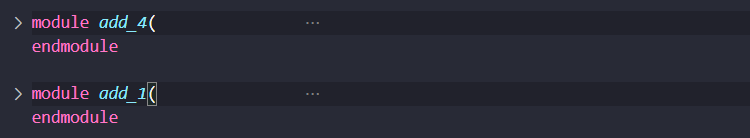
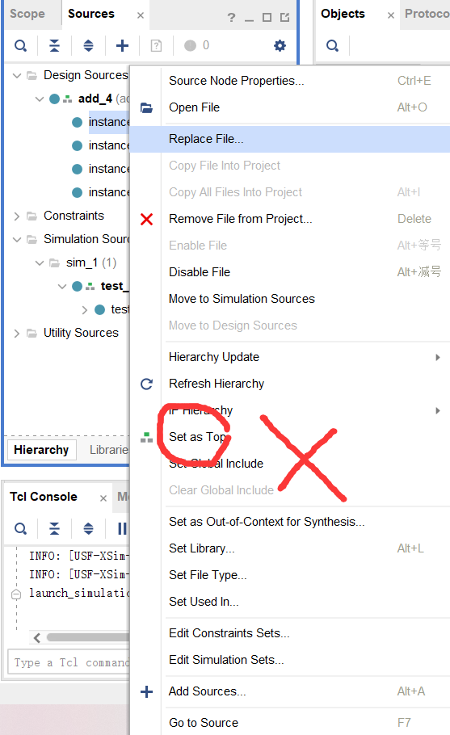
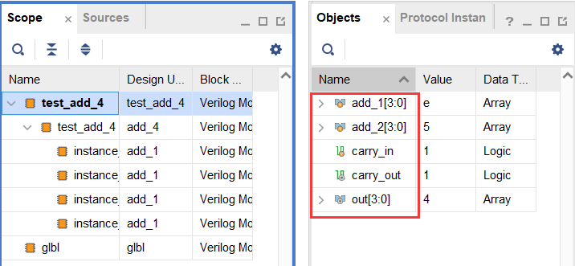
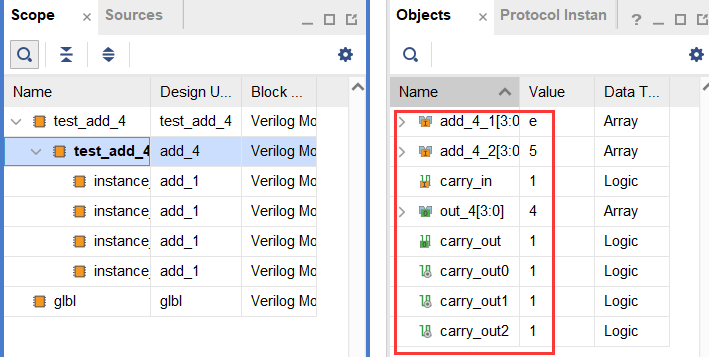
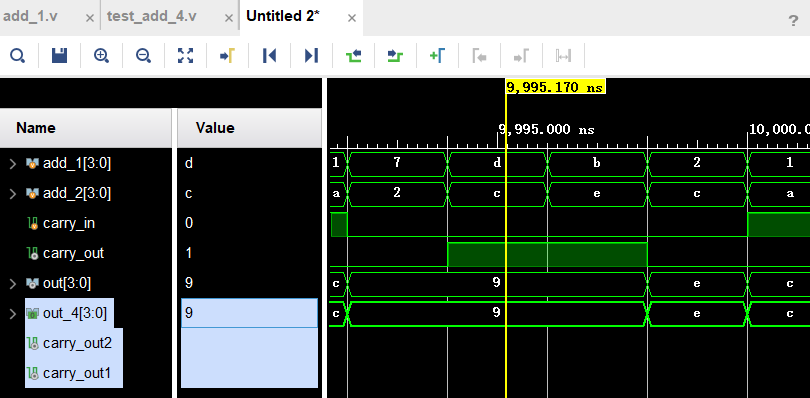
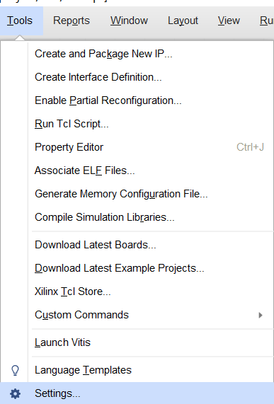
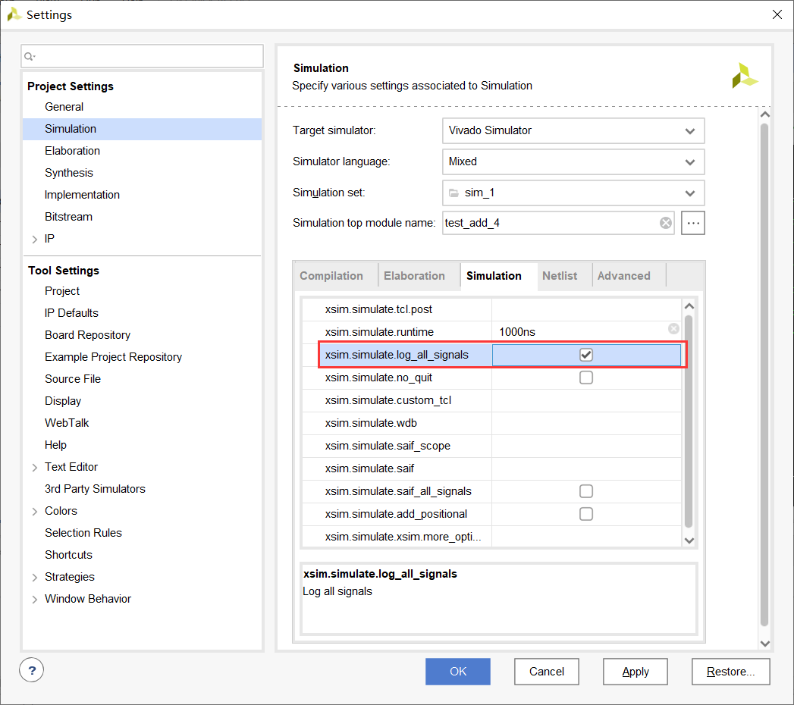

## <center>Verilog自救指北<center>

​	verilog的语法和C语言十分相似，比如控制流（if else， case）、条件表达式（？：）、运算操作等等，但是verilog是硬件描述语言，是并行并发的，并不能完全用C语言的串行思维理解。如下的两个assign语句和两个always块是`同时执行`的，而不像C语言一般串行执行。

```verilog
assign a = b + c;
assign x = y - z;

always @(posedge clk)
begin
    ... ...
end

always @(state)
begin
    ... ...
end
```

​	verilog的学习包括代码编写和vivado工具使用。代码编写又包括设计文件和激励文件。


## 设计文件编写

​	代码的基本结构是按照模块来划分的，不同的不同模块之间的联系通过`例化`这一操作来实现（类似C语言的函数调用，但是是并行的思维）。设计文件编写需要掌握模块结构、模块例化方法、wire和reg数据类型、控制流、always块等内容。

​	wire类型变量使用组合逻辑赋值，reg类型主要在时序逻辑赋值(学会使用这两种类型在gkd就已经足够了)。wire类型的赋值使用assign语句；reg类型变量在always块(always @(信号))中赋值。

#### 组合逻辑设计

​	最快的学习方法还是直接看代码，下面是一个一位加法器的实现：

```verilog
module add_1(				//定义时 module + 模块名 + （端口信号）; 
    input  add_1	,		//信号分为input和output，中间用","分隔
    input  add_2	,
    input  carry_in	,
    
    output out		,
    output carry_out		//最后一个信号不用分隔
    );						//以";"结束
    // assign语句，对wire类型信号进行赋值
    // {}表示位拼接，下面的意思就是把carry_out和out两个一位信号组合成一个两位信号
    // 这样相加的时候进位就自然而然地就是第二位了
    assign {carry_out, out} = add_1 + add_2 + carry_in;

endmodule
```

​	在这段代码中主要体现了组合逻辑赋值以及位拼接运算符的使用。

​	接着就可以通过例化的四个一位加法器实现一个串行进位的四位加法器，例化就可以理解为我把一个设计好的部件复制过来用，给它输入，获得它的输出。一个模块中可以多次例化同一个模块。例化的格式如下：

```verilog
// module_name是我们要例化的那个模块的名字
// instance_name是我把这个模块拿过来用之后新起的名字
module_name instance_name(
    // module_signal是我要例化的那个模块原本的信号名
    // instance_signal是我用这个例化后的模块时把我的什么信号输进去
    // 				  把例化模块的输出信号赋给我的哪一个信号
    // 信号描述之间用","分隔，最后一个不加","
    .module_signal_1(instance_signal_1),
    ... ...
    .module_signal_2(instance_signal_2)
    );
```

​	在使用四个一位加法器拼接成一个四位串行加法器的时候，需要注意全加器的cin和cout信号的连接：


​	需要把四位加法器的cin作为第一个加法器的cin，第一个加法器的cout当作第二个加法器的cin，以此类推，那么例化四个一位加法器就是使用下面的方式：

```verilog
module add_4(				// 四位加法器模块及信号
    input [3:0] add_4_1	,
    input [3:0] add_4_2	,
    input       carry_in,
    
    output [3:0] out_4	,
    output      carry_out
    );
    wire carry_out0;	// 第一个加法器的cout
    wire carry_out1;
    ... ... 
    
    // 一位加法器模块本名(子模块名)  例化模块名(父模块名)
    add_1 	instance_add_4_1(
        // add_1信号  例化时实际信号
        //或子模块端口名 父模块端口名
        .add_1		(add_4_1[0]),
        .add_2		(add_4_2[0]),
        // 例化使用的信号可以与被例化模块的信号名称相同，但需要注意区分不要弄混
        .carry_in	(carry_in)	,	
        .out		(out_4[0])	,
        .carry_out	(carry_out0)
    );
    
    add_1 	instance_add_4_2(
        .add_1		(add_4_1[1]),
        .add_2		(add_4_2[1]),
        .carry_in	(carry_out0),	
        .out		(out_4[1])	,
        .carry_out	(carry_out1)
    );
    ... ...
    
endmodule
```

​	在这个代码中主要体现出来模块例化与端口信号连接。


​	书上的第二个例子是一个译码和编码的应用，它的实现是在always模块里面使用了case语句，用这种方式实现一个38译码器如下所示

```verilog
module decode_38(
    input  [2:0] data_in,
    output reg [7:0] data_out
    );
    // 一般来说认为@(posedge/negedge clk)是时序逻辑，@某个信号的是电平触发算作组合逻辑
    // 组合逻辑的定义是当前的输出只取决于当前的输入，与电路原来的状态无关，
    // 虽然这里使用了一个reg信号，下面的这类写法算是在模拟组合逻辑
    always@(data_in) 
       begin 
        case(data_in)
            3'd0:data_out = 8'b00000001;
            3'd1:data_out = 8'b00000010;
            3'd2:data_out = 8'b00000100;
            3'd3:data_out = 8'b00001000;
            3'd4:data_out = 8'b00010000;
            3'd5:data_out = 8'b00100000;
            3'd6:data_out = 8'b01000000;
            3'd7:data_out = 8'b10000000;
            // case语句最好加上default
            default: data_out = 8'b00000000;
         endcase
     end
     
endmodule
```

​		上面的代码主要用到了case语句，展示了组合逻辑的另一种写法以及常量的声明。case语句最好都给加上default，整形常量一般形如：[**位宽**]'[**进制**] [**数字**]，b：二进制，d：十进制，h：十六进制，o：八进制，如上的3'd7即十进制的7。always表达的组合逻辑使用较少，一般只在描述状态机的时候使用，38一个更好的写法如下（其实大部分可以用always写的基本上也可以直接用assign）：

```verilog
module decoder_38(
    input  [2:0] in,
    output [7:0] out
    );
    assign out[0] = (in == 3’d0);
    assign out[1] = (in == 3’d1);
    assign out[2] = (in == 3’d2);
    assign out[3] = (in == 3’d3);
    assign out[4] = (in == 3’d4);
    assign out[5] = (in == 3’d5);
    assign out[6] = (in == 3’d6);
    assign out[7] = (in == 3’d7);
endmodule
```


​    **对于一个多位数据来说，能同时对不同的位进行操作**，这个也是verilog硬件思维的一个重要体现。

​    对应地，也可以使用条件表达式 ? : 实现83编码器：

```verilog
module encoder_8_3(
    input [7:0] in,
    output [2:0] out
    );
    assign out = in[0] ? 3’d0 :
                 in[1] ? 3’d1 :
                 in[2] ? 3’d2 :
                 in[3] ? 3’d3 :
                 in[4] ? 3’d4 :
                 in[5] ? 3’d5 :
                 in[6] ? 3’d6 :
                         3’d7;
endmodule
```


#### 时序逻辑设计

```
// ...TODO...
```


## 激励文件编写

​    我要对这个设计进行测试，肯定要对它进行信号输入，获取它的输出观察他的行为是否符合自己的预期。那么激励文件其实就是对你的**整体模块进行了一次例化**，又因为测试文件本身并没有输入输出，在编写激励文件的时候大概呈现出下面的格式：

```verilog
module test_xxx(    );
    // input输入为了保证信号稳定设为reg类型
    reg  [x:0] input_signal_1;
    reg  [x:0] input_signal_2;
    ... ...
    // output模块的输出一般设为wire
    wire [x:0] output_signal_1;
    wire [x:0] output_signal_2;
    
    // 进行模块例化，按照前述的格式进行即可
    module_name instance_name(
        // module_signal是例化的模块原本的信号名
        // instance_signal是在本文件里例化时使用的信号名
        .module_signal_1(input_signal_1),
        ... ...
        .module_signal_x(output_signal_1)
        ... ...
        );

    // 对模块输入reg信号进行初始化，输出信号不用初始化
    initial begin
        input_signal_1 = x'b0; (一般初始化为0，特殊情况按照要求进行)
        input_signal_2 = x'b0; (x是指该信号位宽，直接写0也可以，但这样显得规范一些)
        ... ...
    end

    // 周期性的对输入信号进行赋值
    always begin
        // 比如在这里每个两个时间单位进行一次重新赋值
        #2;
        input_signal_1 = xxx;
        // 也可以接着隔不同周期继续赋值，但是同一个信号不能多次赋值
        input_signal_2 = xxx;
    end
endmodule
```


​    如果对我们上面提到的4位加法器进行测试，就会如下所示：

```verilog
module test_add_4(    );
    // 需要用到的测试信号，三个输入，两个输出
    // 信号名可以和原模块一样，但是要注意例化时的区分
    reg  [3:0] add_1;
    reg  [3:0] add_2;
    reg        carry_in;
    wire       carry_out;
    wire [3:0] out;
    
    // 例化四位加法器模块
    // 四位加法器模块又例化四个一位加法器，但我们并不用管，这是四位加法器模块实现并封装好的
    add_4 test_add_4(
        .add_4_1  (add_1    ),
        .add_4_2  (add_2    ),
        .carry_in (carry_in ),
        .out_4    (out      ),
        .carry_out(carry_out)
    );

    // 将输入初始化为0
    initial begin
        add_1 <= 4'b0;
        add_2 <= 4'b0;
        carry_in <= 1'b0;
    end

    // 每隔2个时间单位重新赋值一个随机数
    always begin
        #2;
        // $random()产生随机数，通过取模得到指定位数(4位)
        // 位拼接可以使用在任意地方，这里也不除外
        add_1    <= $random() % {1'b1, 4'b0};
        add_2    <= $random() % {1'b1, 4'b0};
        carry_in <= $random() % 2;
    end
endmodule
```


​    看完一个例子之后其实就已经完全足够了，较简单的测试文件的编写都差不多：初始化，固定周期赋值。其实还有打印输出等较复杂操作，但基本用不到，理解上面这个例子、理解测试就是一个整体的例化就够了。


## 常见错误

```
// ...TODO...
```


## vivado使用小细节

​    如何建立project、设计文件和激励文件应该都有讲，这里就简单地说一些使用时的小细节。

###### 一、如果我有多个模块，该怎么组织设计文件：

​    比如一个上面的四位加法器，需要一个四位加法器模块，还需要一个一位加法器模块。有两种方式：

1. 把四位加法器模块和一位加法器模块放在一个文件里

   

2. 创建两个文件，建议先创建顶层的add_4文件，再创建add_1。不过不按顺序的话Vivado也会自动调整好顶层文件。调整好后如下所示：

   

3. 顶层文件不要随意改变，否则会造成测试的时候信号对不上，产生高阻态和不定态（我有一次就是设置了top文件造成高阻态干坐一节课等老师过来才解决）




###### 二、查看波形小技巧

​    还是以四位加法器为例，波形跑出来后的画面如下所示


​    有四个地方需要注意

- 仿真快捷键：

  1. `restart`：从头开始，重新仿真，但是测试文件修改之后用这个没法得到新的测试，用的不多。
  2. `run all`：一直进行测试，直到程序停止，数电实验用的不多，体系结构有专门的测试程序会经常用
  3. `run for xxx us`：进行指定时间的仿真，点击之后会再向前进行特定时长的仿真，默认设为了10us，可以自行设置。
  4. `step`：没用过
  5. `relunch`：重新进行仿真，修改测试文件或设计文件后点击可以重新仿真，比关闭再润要快很多，经常用！

  

- 模块(信号范围)选择

  

    按照我们的设计，测试文件位于顶层，例化`add_4`，而`add_4`又例化四个`add_1`，呈现出上面这样的树状结构。

    选中某个模块之后在右侧`objects`中会显示出具体信号

  - 测试模块及信号

  

  - add_4模块及信号

  

  

- 具体信号选择

    在`objects`中看到具体信号之后，可以通过鼠标拖拽的方式，将某一信号加入到波形中。比如，仿真默认只给出测试模块的信号，可以把`add_4`的内部信号拖过去查看：

  

    这里加入三个信号，一个是`add_4`的输出`out_4`，还有两个`add_4`内部定义的进位信号。这时候会发现有一个是有波形的，两个是没有任何显示的，这是因为`out_4`本来就是输出到测试模块的。需要重新运行仿真才能看到另外两个(Tips: 点击右上角的`relaunch`)。

    可以通过设置一次仿真得到所有信号信息，在新加入后也能直接看到波形。(设置方法见后面的`记录所有信号信息方法`）

  

- 波形界面

    波形观察的时候：

  - 可以用鼠标缩放
  - 可以用上下左右来控制光标(左右是移动到最近的不同值的附近)
  - 查找某一特定值(计组和体系结构用的多)
  - 移动到仿真开始和结束
  - 左右移动(和左右键一样，移动到最近的不同值的附近)
  - 添加光标(用处不多，写报告的时候可以用一用，指示信号位置)


###### 记录所有信号信息方法

1. 找到`settings`:

   

2. 勾选`log_all_signals`:

   


```
// ...TODO...
```


## 注意事项：

- 电平逻辑一般有四种：0， 1， Z(高阻)， X(未知)

- 例化时模块信号要注意接对，并且不能悬空，如果没有接对应的信号可能会出现高阻态。

- 组合逻辑一般使用assign，较少情况下如状态机才可能用到always块，且里面赋值使用阻塞赋值（=）

  (非阻塞赋值"<="用于时序逻辑对reg类型的更新，具体对比后续再说)

- 如果是进行逻辑位运算，建议使用`&、|、^、~`，如果是条件判断，建议使用`&&、||、！`

- 运算优先级如下图所示：


时序逻辑的例子：p334   13进制计数器、售货机的状态机


#### 一些教程链接：

[Verilog 菜鸟教程](https://www.runoob.com/w3cnote/verilog-tutorial.html)

