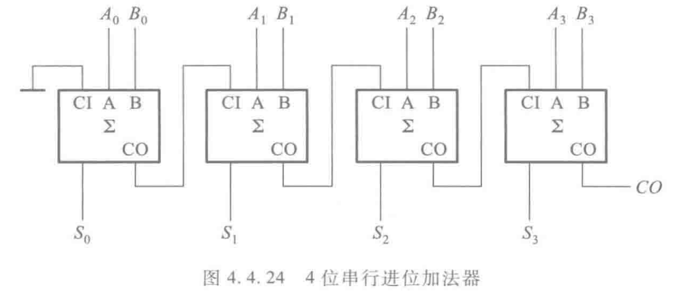
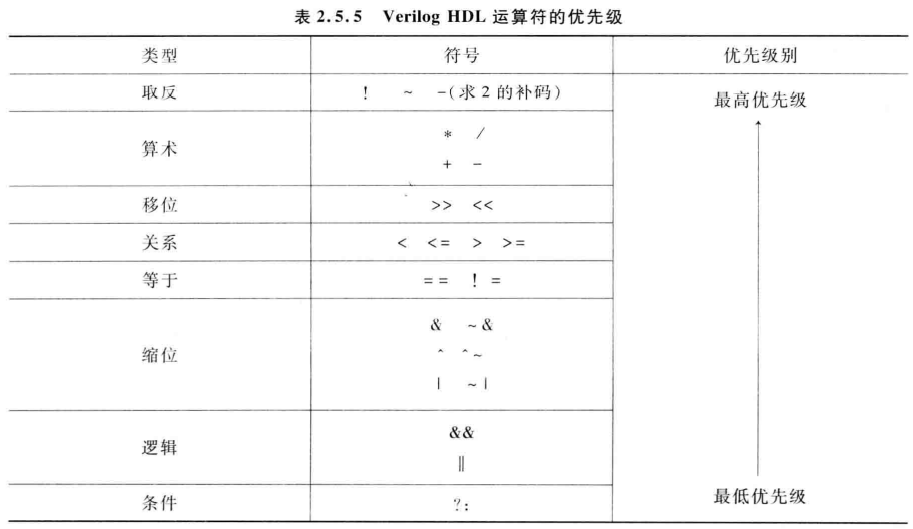

# <center>Verilog自救指北<center>

​	verilog的语法和C语言十分相似，比如控制流（if else， case）、条件表达式（？：）、运算操作等等，但是verilog是硬件描述语言，是并行并发的，并不能完全用C语言的串行思维理解。如下的两个assign语句和两个always块是`同时执行`的，而不像C语言一般串行执行。

```verilog
assign a = b + c;
assign x = y - z;

always @(posedge clk)
begin
    ... ...
end

always @(state)
begin
    ... ...
end
```

​	verilog的学习包括代码编写和vivado工具使用。代码编写又包括设计文件和激励文件。


## 设计文件编写

​	代码的基本结构是按照模块来划分的，不同的不同模块之间的联系通过`例化`这一操作来实现（类似C语言的函数调用，但是是并行的思维）。设计文件编写需要掌握模块结构、模块例化方法、wire和reg数据类型、控制流、always块等内容。

​	wire类型变量使用组合逻辑赋值，reg类型主要在时序逻辑赋值(学会使用这两种类型在gkd就已经足够了)。wire类型的赋值使用assign语句；reg类型变量在always块(always @(信号))中赋值。

#### 组合逻辑设计

​	最快的学习方法还是直接看代码，下面是一个一位加法器的实现：

```verilog
module add_1(				//定义时 module + 模块名 + （端口信号）; 
    input  add_1	,		//信号分为input和output，中间用","分隔
    input  add_2	,
    input  carry_in	,
    
    output out		,
    output carry_out		//最后一个信号不用分隔
	);						//以";"结束
    // assign语句，对wire类型信号进行赋值
    // {}表示位拼接，下面的意思就是把carry_out和out两个一位信号组合成一个两位信号
    // 这样相加的时候进位就自然而然地就是第二位了
    assign {carry_out, out} = add_1 + add_2 + carry_in;

endmodule
```

​	在这段代码中主要体现了组合逻辑赋值以及位拼接运算符的使用。

​	接着就可以通过例化的四个一位加法器实现一个串行进位的四位加法器，例化就可以理解为我把一个设计好的部件复制过来用，给它输入，获得它的输出。一个模块中可以多次例化同一个模块。例化的格式如下：

```verilog
// module_name是我们要例化的那个模块的名字
// instance_name是我把这个模块拿过来用之后新起的名字
module_name instance_name(
    // module_signal是我要例化的那个模块原本的信号名
    // instance_signal是我用这个例化后的模块时把我的什么信号输进去
    // 				  把例化模块的输出信号赋给我的哪一个信号
    // 信号描述之间用","分隔，最后一个不加","
    .module_signal_1(instance_signal_1),
    ... ...
    .module_signal_2(instance_signal_2)
	);
```

​	在使用四个一位加法器拼接成一个四位串行加法器的时候，需要注意全加器的cin和cout信号的连接：



​	需要把四位加法器的cin作为第一个加法器的cin，第一个加法器的cout当作第二个加法器的cin，以此类推，那么例化四个一位加法器就是使用下面的方式：

```verilog
module add_4(				// 四位加法器模块及信号
    input [3:0] add_4_1	,
    input [3:0] add_4_2	,
    input       carry_in,
    
    output [3:0] out_4	,
    output      carry_out
    );
    wire carry_out0;	// 第一个加法器的cout
    wire carry_out1;
    ... ... 
    
    // 一位加法器模块本名(子模块名)  例化模块名(父模块名)
    add_1 	instance_add_4_1(
    	// add_1信号  例化时实际信号
        //或子模块端口名 父模块端口名
        .add_1		(add_4_1[0]),
        .add_2		(add_4_2[0]),
        // 例化使用的信号可以与被例化模块的信号名称相同，但需要注意区分不要弄混
        .carry_in	(carry_in)	,	
        .out		(out_4[0])	,
        .carry_out	(carry_out0)
    );
    
    add_1 	instance_add_4_2(
        .add_1		(add_4_1[1]),
        .add_2		(add_4_2[1]),
        .carry_in	(carry_out0),	
        .out		(out_4[1])	,
        .carry_out	(carry_out1)
    );
	... ...
    
endmodule
```

​	在这个代码中主要体现出来模块例化与端口信号连接。


​	书上的第二个例子是一个译码和编码的应用，它的实现是在always模块里面使用了case语句，用这种方式实现一个38译码器如下所示

```verilog
module decode_38(
    input  [2:0] data_in,
    output reg [7:0] data_out
	);
    // 一般来说认为@(posedge/negedge clk)是时序逻辑，@某个信号的算作组合逻辑
    // 组合逻辑的定义是当前的输出只取决于当前的输入，与电路原来的状态无关，
    // 虽然这里使用了一个reg信号，下面的这类写法算是在模拟组合逻辑（个人觉得不是很恰当，建议少用
	always@(data_in) 
   	begin 
        case(data_in)
            3'd0:data_out = 8'b00000001;
            3'd1:data_out = 8'b00000010;
            3'd2:data_out = 8'b00000100;
            3'd3:data_out = 8'b00001000;
            3'd4:data_out = 8'b00010000;
            3'd5:data_out = 8'b00100000;
            3'd6:data_out = 8'b01000000;
            3'd7:data_out = 8'b10000000;
            // case语句最好加上default
            default: data_out = 8'b00000000;
         endcase
     end
     
endmodule
```

​		上面的代码主要用到了case语句，展示了组合逻辑的另一种写法以及常量的声明。case语句最好都给加上default，整形常量一般形如：[**位宽**]'[**进制**] [**数字**]，b：二进制，d：十进制，h：十六进制，o：八进制，如上的3'd7即十进制的7。always表达的组合逻辑使用较少，一般只在描述状态机的时候使用，38一个更好的写法如下（其实大部分可以用always写的基本上也可以直接用assign）：

```verilog
module decoder_38(
	input  [2:0] in,
	output [7:0] out
	);
	assign out[0] = (in == 3’d0);
	assign out[1] = (in == 3’d1);
	assign out[2] = (in == 3’d2);
	assign out[3] = (in == 3’d3);
	assign out[4] = (in == 3’d4);
	assign out[5] = (in == 3’d5);
	assign out[6] = (in == 3’d6);
	assign out[7] = (in == 3’d7);
endmodule
```

​		对应地，也可以使用条件表达式 ? : 实现83编码器：

```verilog
module encoder_8_3(
	input [7:0] in,
	output [2:0] out
	);
	assign out = in[0] ? 3’d0 :
				 in[1] ? 3’d1 :
				 in[2] ? 3’d2 :
				 in[3] ? 3’d3 :
				 in[4] ? 3’d4 :
				 in[5] ? 3’d5 :
				 in[6] ? 3’d6 :
						 3’d7;
endmodule
```

​	组合逻辑设计大概就这么多内容。

#### 时序逻辑设计


## 激励文件编写


## 常见错误

## vivado使用小细节

#### **注意事项**：

- 电平逻辑一般有四种：0， 1， Z(高阻)， X(未知)

- 例化时模块信号要注意接对，并且不能悬空，如果没有接对应的信号可能会出现高阻态。

- 组合逻辑一般使用assign，较少情况下如状态机才可能用到always块，且里面赋值使用阻塞赋值（=）

  (非阻塞赋值"<="用于时序逻辑对reg类型的更新，具体对比后续再说)

- 如果是进行逻辑位运算，建议使用`&、|、^、~`，如果是条件判断，建议使用`&&、||、！`

- 运算优先级如下图所示：




时序逻辑的例子：p334   13进制计数器、售货机的状态机


#### 一些教程链接：

[Verilog 教程 | 菜鸟教程 ](https://www.runoob.com/w3cnote/verilog-tutorial.html)

